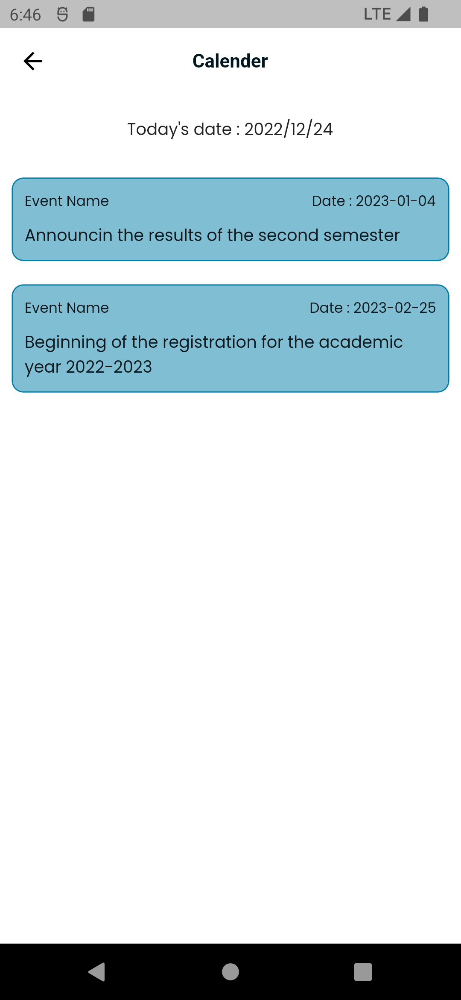
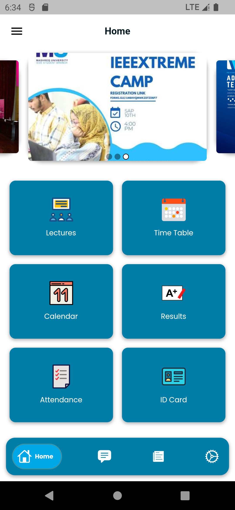
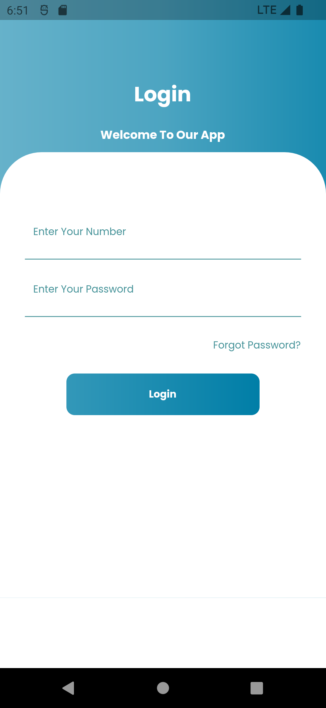
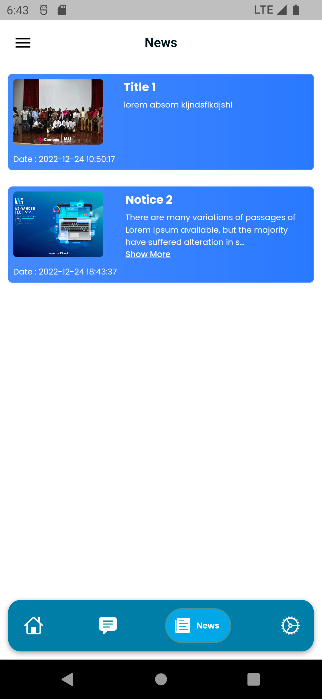
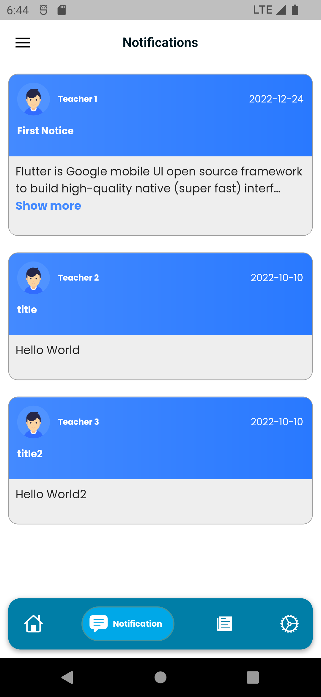
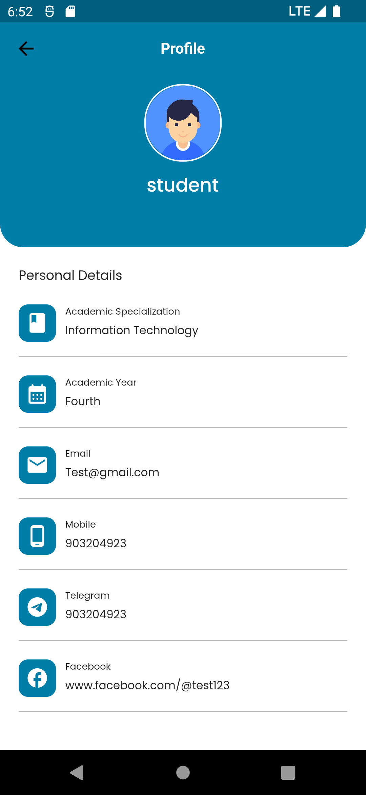
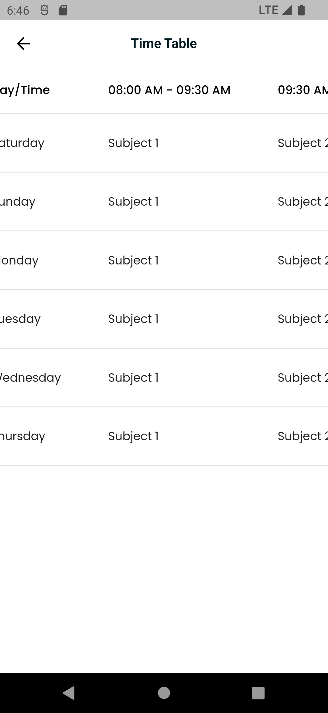
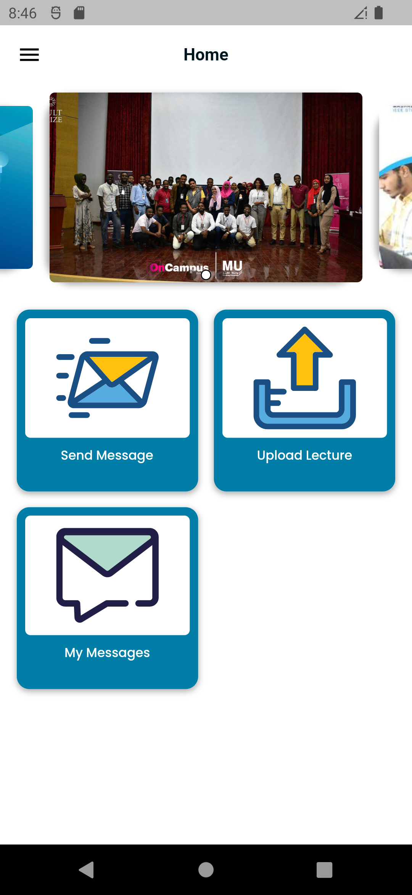

# Campus Mobile Application

The campus mobile application offers a comprehensive solution by providing easy access to information, enhancing communication, and improving the overall campus experience for students and teachers. It is built using Flutter for the frontend and Laravel for the backend.

## Student Screens

<table align="center">
  <tr>
    <td align="center">
      <strong>Attendance Screen 1</strong> 
      
    </td>
    <td align="center">
      <strong>Attendance Screen 2</strong> 
      
    </td>
    <td align="center">
      <strong>Calendar Screen</strong> 
      
    </td>
  </tr>
  <tr>
    <td align="center">
      <strong>Home Screen</strong> 
      
    </td>
    <td align="center">
      <strong>Lectures Screen 1</strong> 
      
    </td>
    <td align="center">
      <strong>Lectures Screen 2</strong> 
      
    </td>
  </tr>
  <tr>
    <td align="center">
      <strong>Login Screen</strong> 
      
    </td>
    <td align="center">
      <strong>Login Validation</strong> 
      
    </td>
    <td align="center">
      <strong>News Screen</strong> 
      
    </td>
  </tr>
  <tr>
    <td align="center">
      <strong>Notifications Screen</strong> 
      
    </td>
    <td align="center">
      <strong>Profile Screen</strong> 
      
    </td>
    <td align="center">
      <strong>Results Screen 1</strong> 
      
    </td>
  </tr>
  <tr>
    <td align="center">
      <strong>Results Screen 2</strong> 
      
    </td>
    <td align="center">
      <strong>Time Table Screen</strong> 
      
    </td>
  </tr>
</table>

## Teacher Screens

<table align="center">
  <tr>
    <td align="center">
      <strong>Attendance Screen</strong> 
      
    </td>
    <td align="center">
      <strong>Home Screen</strong> 
      
    </td>
    <td align="center">
      <strong>Send Message</strong> 
      
    </td>
  </tr>
  <tr>
    <td align="center">
      <strong>Upload Lecture 1</strong> 
      
    </td>
    <td align="center">
      <strong>Upload Lecture 2</strong> 
      
    </td>
  </tr>
</table>
